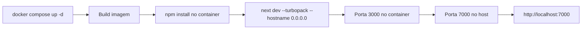

# Arquitetura — GST-7: Docker Dev Setup

## Visão Geral

```
hint/                          (raiz do repo)
├── .dockerignore              ← NOVO
├── Dockerfile                 ← NOVO
├── docker-compose.yml         ← NOVO
├── frontend/                  (código Next.js existente)
│   ├── package.json
│   ├── package-lock.json
│   ├── src/
│   └── ...
├── docs/
└── assets/
```

O Docker encapsula apenas o diretório `frontend/`. Os arquivos de configuração ficam na raiz para manter a organização do monorepo (caso futuros serviços sejam adicionados).

## Componentes

### 1. Dockerfile

```dockerfile
FROM node:20-alpine
WORKDIR /app
COPY frontend/package.json frontend/package-lock.json ./
RUN npm install
COPY frontend/ .
EXPOSE 3000
CMD ["npm", "run", "dev", "--", "--hostname", "0.0.0.0"]
```

**Decisões:**
- `node:20-alpine`: Menor footprint, compatível com `@types/node: ^20`
- `COPY package*.json` primeiro: Aproveita cache de layers do Docker (instala deps antes de copiar código)
- `--hostname 0.0.0.0`: Necessário para que o Next.js aceite conexões de fora do container
- Sem multi-stage: Não é necessário para ambiente de dev

### 2. docker-compose.yml

```yaml
services:
  frontend:
    build: .
    ports:
      - "7000:3000"
    volumes:
      - ./frontend:/app
      - /app/node_modules
      - /app/.next
```

**Decisões:**
- Volume bind mount `./frontend:/app`: Sincroniza código do host com o container para hot reload
- Volume anônimo `/app/node_modules`: Preserva os node_modules instalados no container (binários compilados para Alpine/musl)
- Volume anônimo `/app/.next`: Evita conflitos de cache do Turbopack entre host e container

### 3. .dockerignore

Exclui `node_modules`, `.next`, `.git`, `*.md`, `assets/`, `.claude/` do contexto de build para reduzir tempo de build e tamanho do contexto.

## Fluxo de Execução



## Impacto no package.json

O script `dev` atual é `next dev --turbopack`. O `--hostname 0.0.0.0` será passado via CMD do Dockerfile (usando `--` para separar args do npm dos args do next), sem alterar o `package.json`.

## Arquivos a Criar

| Arquivo | Ação |
|---|---|
| `Dockerfile` | Criar |
| `docker-compose.yml` | Criar |
| `.dockerignore` | Criar |

Nenhum arquivo existente será modificado.

## Riscos e Mitigações

| Risco | Mitigação |
|---|---|
| `sharp` binário incompatível entre host/container | Volume anônimo para `node_modules` isola binários |
| Hot reload não funciona | Linux usa inotify nativo, sem necessidade de polling |
| Cache do Turbopack corrompido | Volume anônimo para `.next` isola o cache |
